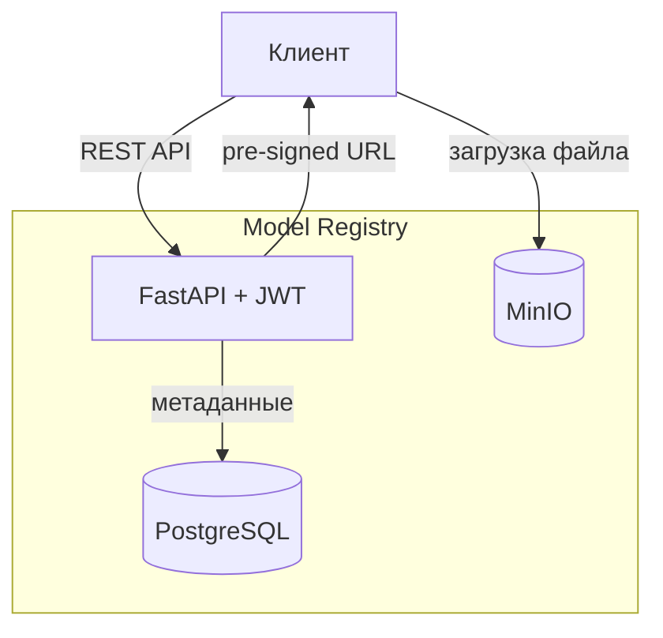
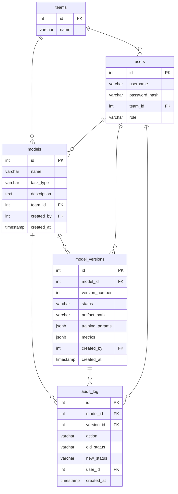

# Условие задания
## Цель ДЗ
Спроектировать и реализовать model registry с нуля.

## Сетап
Дано несколько ML-команд, которые обучают модели и складывают их в директорию на определенную машинку. 

Текущее состояние хаоса представляет собой примерно такую структуру:
```
models/
models/mlds_1/my_model_v1/
models/mlds_3/sft_modell_v_123/
models/mlds_180/model_v1_v0_with_rank_dataset_0/
models/mlds_180/model_v1_v0_with_rank_dataset_1/
models/mlds_180/model_v1_v0_without_rank_dataset_0/
models/mlds_180/model_v1_v0_without_rank_dataset_1/
```
                  
Больше информации по моделям нет никакой, только папки.

## Что вам нужно сделать

- Сформулировать существующие проблемы, зафиксировать их.

- На их основе продумать функциональные и нефункциональные требования к системе хранения моделей, зафиксировать эти требования.

- На основе требований спроектировать архитектуру системы, отобразить ее в виде схемы, обосновать все компоненты и выбор технологий.

- Продумать API и схему БД.

- Реализовать спроектированную систему.

# Существующие проблемы
**Полное отсутствие метаданных**

Команды складывают модели в папки, которые не имеют четкой структуры создания имени, из которой можно было бы получить информацию о модели: какой датасет обучения, метрики качества и гиперпараметры. Это полностью убивает возможность воспроизводить эксперименты.

**Отсутствие версионирования**

Исходя из примеров, разные команды по разному пытаются версионировать модели с помощью нейминга папок, но как не трудно заметить, получается у них это плохо: разные команды по разному называют папки. Все это приводит к бардаку, в котором определить версию модели невозможно.

**Отсутствие информации о жизненном цикле модели**

Не понятно, в каком состоянии находится модель: что сейчас на проде, а что уже устарело.

**Не понятно, кто что делал**

В примере команды создают свою папку, но в ручном формате это может привести к путанице: не понятно, `mlds_180` это 18 или 180 команда? Из-за отсутствия общего регламента написания папок рано или поздно случится бардак в каталогах.

# Требования к системе
## Функциональные требования
**Регистрация и хранение**
- Регистрация модели с обязательными метаданными: название модели, команда, автор, что за задача.
- Загрузка артефактов модели
- Загрузка метрик качества для каждой версии модели
- Привязка информации о датасете и параметрах обучения

**Версионирование**
- Автоматическая нумерация версий при регистрации новой версии модели
- Возможность просмотра истории версий
- Возможность сравнения метрик между версиями

**Жизненный цикл**
- Хранение статуса жизненного цикла модели
- Возможность менять статус
- Только одна версия может быть Production одновременно

**Каталог и поиск**

- Поиск по параметрам модели (название, команда, задача и т.д.)
- Поиск по метрикам с фильтрацией (к примеру модели с `accuracy > 0.9`)

**Аудит**
- Логирование любых изменений моделей

**Контроль доступа**
- Команды могут управлять только своими моделями
- Смена статуса в Production требует прав admin или team-lead

## Нефункциональные требования
**Надёжность**
- Артефакты моделей не должны теряться. Необходима репликация хранилища.
- Должна соблюдаться консистентность метаданных и артефактов: не должны быть записи без файлов и наоборот.

**Масштабируемость**
- Система должна выдерживать рост числа моделей и быть готовой к хранению больших файлов.

**Производительность**
- Чтение метаданных из API должно быть достаточно быстрым.
- Загрузка и скачивание артефактов должно работать напрямую из хранилища.

**Эксплуатация**
- Логирование всех запросов к API.
- Метрики использования системы.

# Архитектура системы

## Схема



Клиент обращается к FastAPI. Метаданные хранятся в PostgreSQL, бинарные артефакты — в MinIO. Для загрузки/скачивания файлов API возвращает pre-signed URL, и клиент работает с MinIO напрямую.

## Компоненты

| Компонент | Технология | Обоснование |
|-----------|-----------|-------------|
| REST API | FastAPI | простой и быстрый фреймворк, хорошо работает из коробки. Идеальный выбор для небольшого проекта. |
| Авторизация | JWT | Удобно реализовать в FastAPI, не обязательно хранить сессии |
| Метаданные | PostgreSQL | Легкий и простой старт, поддержка JSONB для хранения метаданных |
| Артефакты | MinIO | удобный для self-hosting S3, удобная настройка репликации |
| Оркестрация | Docker Compose | простой запуск всех сервисов одной командой, кубер избыточен для такого задания|

# API

## Аутентификация

| Метод | Путь | Описание |
|-------|------|----------|
| POST | `/auth/login` | Получить JWT-токен |

Все остальные эндпоинты требуют заголовок `Authorization: Bearer <token>`.

## Модели

| Метод | Путь | Описание | Права |
|-------|------|----------|-------|
| POST | `/models` | Зарегистрировать модель | любой |
| GET | `/models` | Список моделей с фильтрацией | любой |
| GET | `/models/{model_id}` | Получить модель | любой |

Параметры фильтрации для `GET /models`: `name`, `team_id`, `task_type`, а также по метрикам — `metric_name=accuracy&metric_op=gt&metric_value=0.9`.

## Версии

| Метод | Путь | Описание | Права |
|-------|------|----------|-------|
| POST | `/models/{model_id}/versions` | Создать новую версию | своя команда |
| GET | `/models/{model_id}/versions` | История версий | любой |
| GET | `/versions/{version_id}` | Детали версии | любой |
| POST | `/versions/{version_id}/upload-url` | Получить pre-signed URL для загрузки артефакта | своя команда |
| GET | `/versions/{version_id}/download-url` | Получить pre-signed URL для скачивания | любой |
| PATCH | `/versions/{version_id}/status` | Сменить статус жизненного цикла | admin / team_lead |

Статусы жизненного цикла: `staging` → `production` → `archived`. Только одна версия модели может иметь статус `production` одновременно — при переводе в `production` предыдущая версия автоматически переходит в `archived`.

## Аудит

| Метод | Путь | Описание | Права |
|-------|------|----------|-------|
| GET | `/models/{model_id}/audit` | Лог изменений модели | admin / своя команда |

# Схема БД



## Таблицы

**teams** — команды.

**users** — пользователи. `role`: `member`, `team_lead`, `admin`.

**models** — сущность модели. Одна модель может иметь множество версий.

**model_versions** — версия модели. `version_number` инкрементируется в рамках модели. `status`: `staging` → `production` → `archived`. `training_params` и `metrics` — JSONB, схема не фиксируется. Частичный уникальный индекс гарантирует один `production` на модель.

**audit_log** — лог изменений. `action`: `create_model`, `create_version`, `status_changed`.